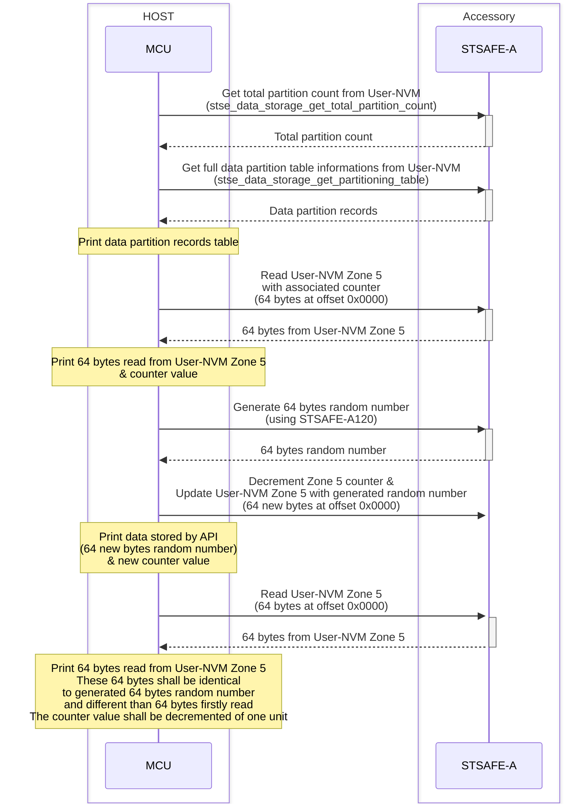
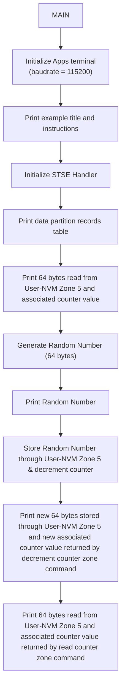

# STSAFE-A Secure data storage
This project illustrates how to use the STSAFE-A Secure Element and STMicroelectronics Secure Element Library to perform data storage through STSAFE-A Secure Element.
When loaded on the target MCU platform , the project performes the storage of 100 bytes through STSAFE-A User-NVM Zone 5. This storage scheme is typically used to store data securely.

The example applicative flowchart is illustrated below :

STSELib API used in the example are the following :

- stse_set_default_handler_value
- stse_init
- stse_data_storage_get_total_partition_count
- stse_data_storage_get_partitioning_table
- stse_data_storage_read_counter_zone
- stse_generate_random
- stse_data_storage_decrement_counter_zone

## Hardware and Software Prerequisites

- [NUCLEO-L452RE - STM32L452RE evaluation board](https://www.st.com/en/evaluation-tools/nucleo-l452re.html)

- [X-NUCLEO-ESE01A1 - STSAFE-A120 Secure element expansion board](https://www.st.com/en/ecosystems/x-nucleo-ese01a1.html)

- [STM32CubeIDE - Integrated Development Environment for STM32](https://www.st.com/en/development-tools/stm32cubeide.html)

- Serial terminal PC software  (i.e. Teraterm)

> [!NOTE]
> If you don't use X-NUCLEO-ESE01A1 board, please refer to section how to adapt the exemple

## Getting started with the project

- Connect the [X-NUCLEO-ESE01A1](https://www.st.com/en/ecosystems/x-nucleo-ese01a1.html) expansion board on the top of the [NUCLEO-L452RE](https://www.st.com/en/evaluation-tools/nucleo-l452re.html) evaluation board.

- Connect the board to the development computer and Open and configure a terminal software as follow (i.e. Teraterm).

- Open the STM32CubeIDE projects located in Application/STM32CubeIDE

- Build the project by clicking the “**Build the active configurations of selected projects\ **” button and verify that no error is reported by the GCC compiler/Linker.

- Launch a debug session then wait the debugger to stop on the first main routine instruction and press Start button to execute the main routine.

> [!NOTE]
> - Power configuation Jumper must be set to 3V3-VCC.
> - The COM port can differ from board to board. Please refer to windows device manager.

<b>Result</b> :

This project reports execution log through the on-board STLINK CDC bridge.
These logs can be analyzed on development computer using a serial terminal application (i.e.: Teraterm).
As example below.

<pre>
----------------------------------------------------------------------------------------------------------------
-                            STSAFE-A120 secure data storage counter zone access example                               -
----------------------------------------------------------------------------------------------------------------
-                                                                                                              -
- description :                                                                                                -
- This examples illustrates how to makes use of the STSAFE-A data storage APIs by performing following         -
- accesses/commands to the target STSAFE device                                                                -
-          o Query STSAFE-A total partition count                                                              -
-          o Query STSAFE-A partitions information                                                             -
-          o Read STSAFE-A zone 5 data & associated counter value                                              -
-          o Decrement STSAFE-A zone 5                                                                         -
-          o Read STSAFE-A zone 5 with new data & new associated counter value                                 -
-                                                                                                              -
- Note : zone IDs used in this example are aligned with STSAFE-A120 SPL05 personalization                      -
-        Accesses parameters must be adapted for other device personalization                                  -
-                                                                                                              -
----------------------------------------------------------------------------------------------------------------
 - Initialize target STSAFE-A120

 - stse_get_data_partitions_configuration
  ID | COUNTER | DATA SEGMENT SIZE | READ AC CR |  READ AC | UPDATE AC CR | UPDATE AC |  COUNTER VAL
 000 |    .    |       1000        |   DENIED   |  ALWAYS  |    DENIED    |   NEVER   | 000000
 001 |    .    |       1000        |   ALLOWED  |  ALWAYS  |    ALLOWED   |   ALWAYS  | 000000
 002 |    .    |       1000        |   ALLOWED  |  ALWAYS  |    ALLOWED   |   ALWAYS  | 000000
 003 |    .    |       1000        |   ALLOWED  |  ALWAYS  |    ALLOWED   |   ALWAYS  | 000000
 004 |    .    |       1000        |   ALLOWED  |  ALWAYS  |    ALLOWED   |   ALWAYS  | 000000
 005 |    x    |       0064        |   ALLOWED  |  ALWAYS  |    ALLOWED   |   ALWAYS  | 4294967280
 006 |    x    |       0064        |   ALLOWED  |  ALWAYS  |    ALLOWED   |   ALWAYS  | 4294967295
 007 |    x    |       0064        |   ALLOWED  |  ALWAYS  |    ALLOWED   |   ALWAYS  | 4294967295
 008 |    x    |       0064        |   ALLOWED  |  ALWAYS  |    ALLOWED   |   ALWAYS  | 4294967295
 009 |    .    |       5120        |   ALLOWED  |  ALWAYS  |    ALLOWED   |   ALWAYS  | 000000
 010 |    .    |       3072        |   ALLOWED  |  ALWAYS  |    ALLOWED   |   ALWAYS  | 000000
 011 |    .    |       2944        |   ALLOWED  |  ALWAYS  |    ALLOWED   |   ALWAYS  | 000000

 - stse_data_storage_read_data_zone (zone : 05 - length : 64 - counter : 4294967280)
  0xD1 0x78 0x0A 0xB2 0x90 0xE9 0x41 0x74 0xA7 0xC3 0x21 0xE0 0x40 0xC5 0xD3 0xCC
  0xE5 0x33 0xF6 0xE7 0x2F 0x9C 0x3B 0x46 0x69 0x6E 0x76 0xC5 0x2A 0x28 0x8D 0x11
  0x7F 0x5F 0x2E 0x80 0xBC 0x63 0x19 0xD0 0xE6 0xA2 0xCD 0xF2 0x75 0x00 0xCD 0xC8
  0x45 0x1E 0x97 0xB8 0xC2 0xAD 0x66 0x1C 0x42 0xA8 0x68 0x56 0x00 0x55 0xB7 0x1E

 - stse_generate_random (length : 64)
  0xCD 0x13 0xFA 0x13 0x05 0x5F 0x3E 0x1E 0x54 0x0C 0xB0 0x12 0xEA 0x69 0x0F 0xED
  0x6F 0x46 0x55 0x0C 0x6B 0x5E 0x80 0xC8 0x41 0xCF 0x74 0x65 0xDC 0x08 0x7C 0xFF
  0x00 0xA5 0xB8 0xC1 0x48 0x19 0xC6 0x2D 0xA1 0xE2 0x75 0x3A 0x7D 0x3B 0x5B 0x16
  0x54 0x97 0x76 0x90 0x42 0x71 0xFE 0x9B 0x91 0x2D 0xFF 0x1F 0x98 0x19 0xE6 0x3B

 - stse_data_storage_decrement_counter_zone (zone = 05 - length = 64 - New counter : 4294967279)
  0xCD 0x13 0xFA 0x13 0x05 0x5F 0x3E 0x1E 0x54 0x0C 0xB0 0x12 0xEA 0x69 0x0F 0xED
  0x6F 0x46 0x55 0x0C 0x6B 0x5E 0x80 0xC8 0x41 0xCF 0x74 0x65 0xDC 0x08 0x7C 0xFF
  0x00 0xA5 0xB8 0xC1 0x48 0x19 0xC6 0x2D 0xA1 0xE2 0x75 0x3A 0x7D 0x3B 0x5B 0x16
  0x54 0x97 0x76 0x90 0x42 0x71 0xFE 0x9B 0x91 0x2D 0xFF 0x1F 0x98 0x19 0xE6 0x3B

  - stse_data_storage_read_data_zone (zone : 05 - length : 64 - counter : 4294967279)
  0xCD 0x13 0xFA 0x13 0x05 0x5F 0x3E 0x1E 0x54 0x0C 0xB0 0x12 0xEA 0x69 0x0F 0xED
  0x6F 0x46 0x55 0x0C 0x6B 0x5E 0x80 0xC8 0x41 0xCF 0x74 0x65 0xDC 0x08 0x7C 0xFF
  0x00 0xA5 0xB8 0xC1 0x48 0x19 0xC6 0x2D 0xA1 0xE2 0x75 0x3A 0x7D 0x3B 0x5B 0x16
  0x54 0x97 0x76 0x90 0x42 0x71 0xFE 0x9B 0x91 0x2D 0xFF 0x1F 0x98 0x19 0xE6 0x3B
</pre>

 ## How to adapt the exemple

 Each STSE handler contains SE's informations mandatory by the STSELib to manage correctly targeted API and services.
-	device_type : STSAFE-A100/ STSAFE-A110/ STSAFE-A120
-	pPersoInfo  : pointer to a specific device perso configuration
-	pActive_host_session : active host session managed by the open session API set
-	pActive_other_session : other session managed by the open session API set.
-	Io : communication bus description like I2C device address , I2C speed
